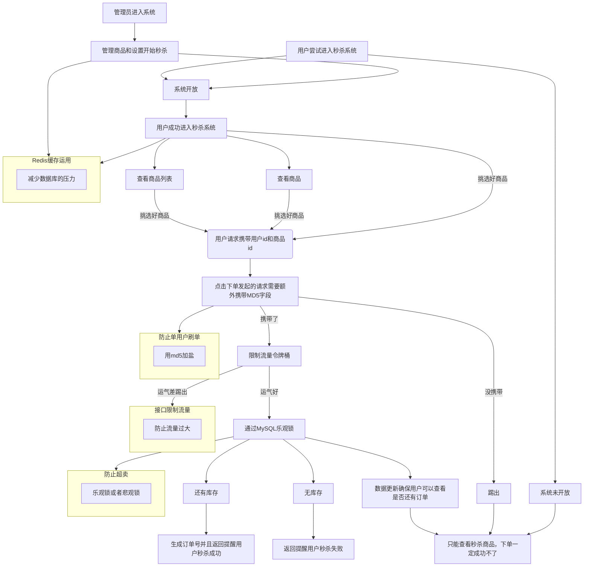

# 秒杀系统方案（第一版）

```mermaid
flowchart TB
 subgraph subgraph_yuybernb4["防止单用户刷单"]
        node_h40opxbmy["用md5加盐"]
  end
 subgraph subgraph_8t6flvp7k["Redis缓存运用"]
        node_bcvxmovrx["减少数据库的压力"]
  end
 subgraph subgraph_kvou6ps5a["接口限制流量"]
        node_6knz17bd1["防止流量过大"]
  end
 subgraph subgraph_bs11r831i["防止超卖"]
        node_61q44ccgw["乐观锁或者悲观锁"]
  end
    A["用户成功进入秒杀系统"] -- 挑选好商品 --> B("用户请求携带用户id和商品id")
    B --> C["点击下单发起的请求需要额外携带MD5字段"]
    C -- 携带了 --> D["限制流量令牌桶"]
    C -- 没携带 --> E["踢出"]
    A --> na["查看商品"] & no["查看商品列表"] & subgraph_8t6flvp7k
    na -- 挑选好商品 --> B
    no -- 挑选好商品 --> B
    nc["管理员进入系统"] --> nq["管理商品和设置开始秒杀"]
    nq --> n8["系统开放"] & subgraph_8t6flvp7k
    nl["用户尝试进入秒杀系统"] --> n8 & ne["系统未开放"]
    ne --> nx["只能查看秒杀商品，下单一定成功不了"]
    E --> nx
    D -- 运气好 --> nu["通过MySQL乐观锁"]
    D -- 运气差踢出 --> subgraph_kvou6ps5a
    nu --> n4["数据更新确保用户可以查看是否还有订单"] & ng["还有库存"] & nz["无库存"] & subgraph_bs11r831i
    n4 --> nx
    ng --> nr["生成订单号并且返回提醒用户秒杀成功"]
    nz --> nv["返回提醒用户秒杀失败"]
    C --> subgraph_yuybernb4
    n8 --> A
```

